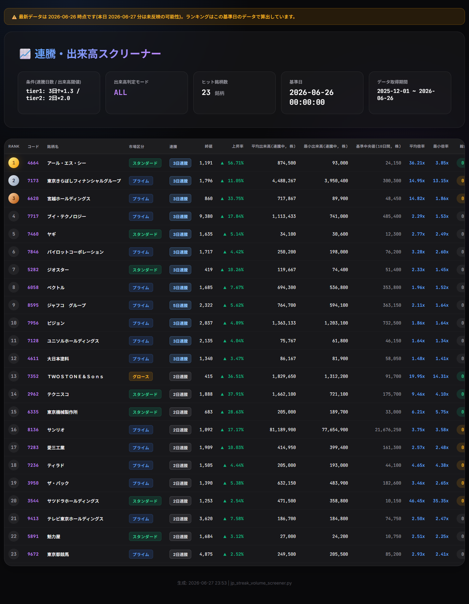
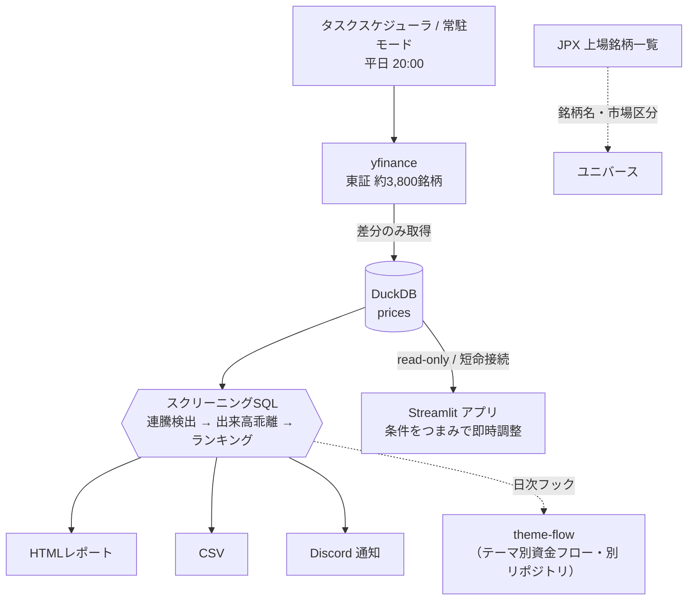

# 📈 日本株 連騰・出来高スクリーナー

東証の全上場銘柄（約3,800銘柄）から、**「数日連続で上昇（陽線）」かつ「出来高が平常時から急増」** している銘柄を毎晩自動で抽出する、個人投資向けのスクリーニングツールです。機関投資家の買い集めや強いトレンドの初動候補を、毎日の終値ベースで効率的に見つけることを目的に開発しました。

CLIによる夜間自動実行（取得 → 抽出 → レポート生成 → Discord通知）と、条件をつまみで対話的に動かせる **Streamlit アプリ** の2つの使い方を備えています。

<p>
  
  
  
  
  
</p>

> **▶ ライブデモ**: https://your-app-name.streamlit.app  ←（Streamlit Cloud デプロイ後にURLを記載）
> 同梱のサンプル株価データ（主要444銘柄）で、実際の操作感をそのまま試せます。



---

## 🎯 背景・解決したかった課題

既存の株式スクリーニングサービスは条件が固定的で、「連騰の**前**と比べてどれだけ出来高が増えたか」という、自分が重視する“初動の質”をうまく表現できませんでした。そこで以下を自分で作ることにしました。

- **連騰中の出来高に引っ張られない**、正確な「平常時からの出来高乖離」の計算
- 全約3,800銘柄を**毎晩自動で**処理し、結果をスマホ（Discord）に届ける運用
- 条件（連騰日数・倍率・流動性・指標）を**その場で動かして**結果を確かめられるUI

## ✨ 主な機能

| 機能 | 説明 |
|---|---|
| 連騰 × 出来高急増の抽出 | 前日比プラスかつ陽線が続く銘柄を、出来高（または売買代金）の急増度と合わせて抽出 |
| 差分データ取得 | 2回目以降は前回以降の差分のみ取得。全銘柄でも高速 |
| 自動ランキング | 「出来高の勢い」と「価格の勢い」を母集団内の順位に正規化して加重合成しスコア化 |
| 自動HTMLレポート | ダーク基調のモダンなレポート（`screen_result.html`）を生成 |
| Discord通知 | 抽出結果の上位銘柄を画像付きで自動通知（環境変数で設定・任意） |
| Streamlit アプリ | 条件をつまみで変えると、再取得なしで結果が即更新。コード/銘柄名で絞り込み・CSV出力 |
| 夜間自動運用 | タスクスケジューラ or 常駐モードで平日20:00に自動実行（日本の祝日はスキップ） |

## 🔬 スクリーニング・ロジック（このツールの肝）

1. **連騰日数の判定** — 最新日から「前日比プラス かつ 終値 > 始値（陽線）」が続く日数を数える。
2. **出来高乖離** — 基準は **連騰が始まる直前 `BASE_WINDOW`(=10) 日間の中央値**。連騰中の出来高は基準計算から除外するため、連騰による出来高増で基準が膨らまず、「平常時からの本当の急増度」を測れる。
3. **2段階（tier）判定** — `STREAK_TOP`(=3) 日以上は通常閾値で tier1、それ未満（短い連騰）は明確に厳しい閾値で tier2 として初動だけ救済。
4. **複合スコア** — 出来高倍率（min_ratio）と上昇率を、それぞれ母集団内の**パーセンタイル順位**に変換してから加重平均。生の値だと単位の大きい出来高が上昇率を支配してしまうのを防ぐ。
5. **流動性フィルタ** — 連騰前の出来高/売買代金の中央値が下限以下の薄商い銘柄を除外（任意）。

> 上記の中核SQL（DuckDB）は合成データによる単体テストで検証しています（[`tests/`](tests/)）。

## 🛠 技術的な工夫（エンジニアリングの見どころ）

- **DuckDB による差分取得・高速集計** — 株価は全置換ではなく前回以降の差分のみ取得。ウィンドウ関数（`LAG` / `ROW_NUMBER` / `PERCENT_RANK` / `MEDIAN ... FILTER`）で連騰判定からランキングまでを1本のSQLで完結。
- **ファイルロック競合を避ける接続設計** — Streamlit アプリは DuckDB 接続を**持ちっぱなしにせず**、操作のたびに短時間だけ開閉する（スクリーニングは read-only 接続）。これにより夜間の自動取得ジョブと**同じDBを共有しても書き込みが阻害されない**。逆に競合した場合も、取得側がリトライして待つ。
- **キャッシュキーの設計** — Streamlit の `st.cache_data` のキーに「設定 + DB最新日」を含め、データ更新後に**自動で再計算**されるようにしている。
- **秘密情報をソースに置かない** — Discord Webhook URL は環境変数 `DISCORD_WEBHOOK_URL` から読み込む（[`.env.example`](.env.example) 参照）。
- **壊れない運用** — yfinance の当日終値の反映遅れを検知して基準日を明記、休日・データ未着時のスキップ、クラウドDB障害時の挙動など、毎日動かす前提のガードを各所に実装。

## 🧱 アーキテクチャ



## 🚀 セットアップ & 使い方

```bash
git clone https://github.com/taisei110/jp-streak-volume-screener.git
cd jp-streak-volume-screener
pip install -r requirements.txt
```

### Streamlit アプリ（おすすめ）

```bash
streamlit run app.py
```

- 起動時に株価取得は走りません。既存DBの内容で即座にランキングが表示されます。
- サイドバーのつまみ（指標・連騰日数・倍率・流動性フィルタ・重み）を変えると、**取得なしで**結果が即更新されます。
- 「🔄 データ取得」を押したときだけ最新の株価を取得します。
- ※ リポジトリには **サンプルDBを同梱**しているため、`git clone` 直後でもそのまま動きます（[公開デモについて](#-公開デモについて)）。

### CLI（夜間自動実行向け）

```bash
python jp_streak_volume_screener.py              # 取得して抽出（タスクスケジューラ向き）
python jp_streak_volume_screener.py --no-fetch   # 取得せず既存DBで再抽出
python jp_streak_volume_screener.py --metric=turnover  # 売買代金版で抽出
python jp_streak_volume_screener.py --daemon     # 常駐し平日20:00に自動実行
```

Discord通知・常駐モードまで使う場合は追加依存を入れます: `pip install -r requirements-cli.txt`

## 🧪 公開デモについて

実運用では `data/prices.duckdb`（約3,800銘柄）を毎晩更新しますが、この実データはリポジトリには含めていません（`.gitignore`）。代わりに、**実際の操作感を試せるサンプルデータ**（主要444銘柄・約半年分）を [`sample_data/`](sample_data/) に同梱しています。

`data/prices.duckdb` が存在しない環境（Streamlit Cloud 等）では、アプリは自動でこのサンプルデータにフォールバックして動作します。ローカルの実運用環境には一切影響しません。

## ✅ テスト

```bash
pip install pytest
pytest -q
```

スクリーニングSQLの中核ロジック（連騰検出・出来高乖離・流動性フィルタ・tier判定）と、データ鮮度判定（反映待ち時刻・土日スキップ）を合成データで検証しています。`main` への push / PR で GitHub Actions が自動実行します。

## ⚙️ 主な設定項目（`jp_streak_volume_screener.py` 冒頭の定数 / アプリのサイドバー）

| 定数 | 既定 | 意味 |
|---|---|---|
| `STREAK_MIN` | 2 | ランクインする最小連騰日数 |
| `STREAK_TOP` | 3 | この日数以上を上位 tier1 に置く |
| `BASE_WINDOW` | 10 | 出来高の基準中央値を取る、連騰前の参照日数 |
| `VOL_MULT` | 1.3 | tier1 の出来高乖離の閾値（倍率） |
| `VOL_MULT_SHORT` | 2.0 | tier2（短い連騰）の足切り倍率 |
| `VOL_MODE` | `all` | `all`=連騰各日すべてで判定（厳しめ）/ `avg`=平均で判定（緩め） |
| `MIN_VOLUME` | 10000 | 流動性フィルタ：連騰前の出来高中央値の下限（0で無効） |

## 📂 ディレクトリ構成

```
.
├── app.py                       # Streamlit アプリ（UI・デモフォールバック）
├── jp_streak_volume_screener.py # CLI本体（取得・スクリーニングSQL・レポート・Discord）
├── screener_core.py             # データ鮮度判定（アプリ専用の薄いモジュール）
├── sample_data/                 # 公開デモ用のサンプル株価DB・銘柄名CSV
├── tests/                       # スクリーニングSQL・鮮度判定の単体テスト
├── .streamlit/config.toml       # アプリのテーマ
├── .github/workflows/ci.yml     # CI（lint + pytest）
├── requirements.txt             # アプリ実行に必要な依存
└── requirements-cli.txt         # CLIの追加依存（Discord通知・常駐）
```

## 📜 ライセンス

MIT License — 詳細は [LICENSE](LICENSE) を参照。

## 👤 Author

**taisei110** — [GitHub](https://github.com/taisei110)

> 投資判断は自己責任で行ってください。本ツールは特定銘柄の売買を推奨するものではありません。データは Yahoo Finance（yfinance）由来であり、その正確性・即時性を保証しません。
